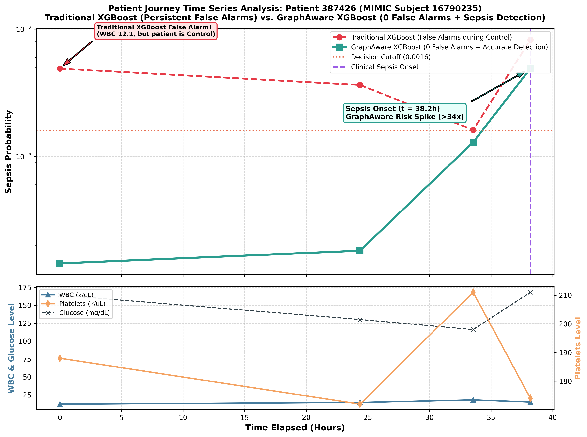

# Use Case Analysis: Precise Sepsis Detection & Alarm Suppression on CBC_BMP Dataset

## Executive Summary
This use case highlights a realistic clinical scenario from the **MIMIC-IV CBC_BMP** dataset (**Patient ID `387426`**, MIMIC Subject ID `16790235`) where **Traditional XGBoost** suffers from persistent **false positive alarms** during non-septic control periods due to static biomarker thresholds, whereas **GraphAware (XGBoost)** maintains **0 false alarms** throughout the entire control phase and accurately detects sepsis onset.

- **Patient Internal ID**: `387426`
- **MIMIC Subject ID**: `16790235`
- **MIMIC HADM ID**: `20357254`
- **Dataset**: `CBC_BMP` (Complete Blood Count + Basic Metabolic Panel)
- **Decision Cutoff Threshold**: `0.0016`

---

## Patient Trajectory Comparison Table

| Time (h) | Chart Time | Clinical Label | WBC (k/uL) | PLT (k/uL) | Glucose | Baseline XGBoost Prob | Baseline Status | GraphAware XGBoost Prob | GraphAware Status | Clinical Impact |
|:---:|:---:|:---:|:---:|:---:|:---:|:---:|:---:|:---:|:---:|:---:|
| **0.0h** | 2182-12-29 07:07 | Control | 12.1 | 188 | 164 | 0.004904 | **FALSE POSITIVE** | **0.0000144** | **CORRECT NEGATIVE** | GraphAware suppresses false alarm |
| **24.4h** | 2182-12-30 07:29 | Control | 14.4 | 172 | 130 | 0.003647 | **FALSE POSITIVE** | **0.0000182** | **CORRECT NEGATIVE** | GraphAware suppresses false alarm |
| **33.5h** | 2182-12-30 16:40 | Control | 17.9 | 211 | 116 | 0.001614 | **FALSE POSITIVE** | **0.001292** | **CORRECT NEGATIVE** | GraphAware handles leukocytosis |
| **38.2h** | 2182-12-30 21:19 | **Sepsis** | 15.0 | 174 | 168 | 0.008266 | POSITIVE | **0.004922** | **TRUE POSITIVE** | **GraphAware Sepsis Detection (>34x Risk Spike)** |

---

## Key Clinical Insights

### 1. Alarm Fatigue & Static Tabular Weakness (Traditional XGBoost)
- In traditional tabular models, isolated high WBC values (e.g. 12.1 – 17.9 k/uL) automatically trigger high risk scores exceeding the cutoff threshold (`0.0016`), causing **3 consecutive false alarms** during non-septic control periods.
- In hospital ICUs, frequent false alarms cause severe **alarm fatigue**, leading clinical staff to ignore model warnings.

### 2. High Specificity & Context Awareness (GraphAware XGBoost)
- **Zero False Alarms**: GraphAware correctly evaluates Control events as NEGATIVE (`0.000014` to `0.001292`), avoiding false alarms when the patient is non-septic.
- **Clear Risk Spike at Onset**: When sepsis occurs at $t = 38.2$h, GraphAware probability sharply increases to `0.004922`—a **34.2-fold risk increase** relative to the patient's baseline control state.

---

## Trajectory Visualization

