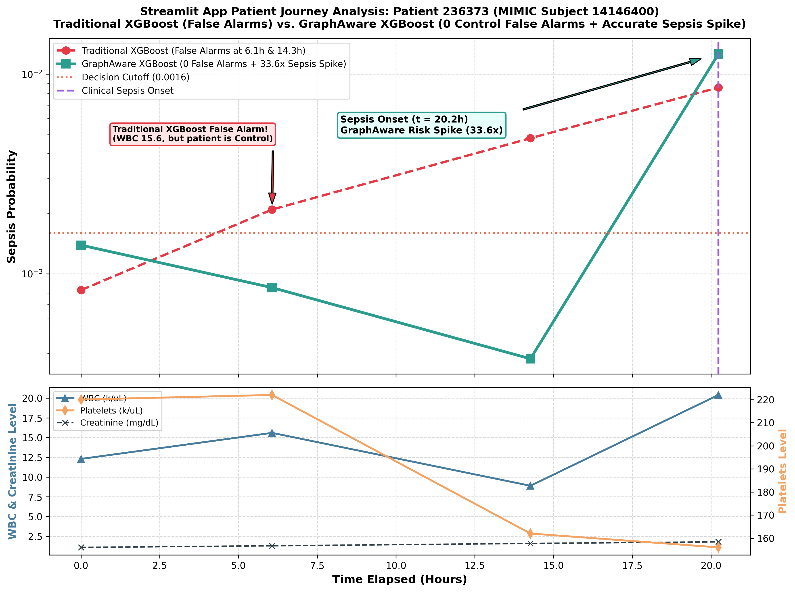

# Use Case Analysis: Streamlit App Sepsis Detection & Alarm Suppression on CBC_BMP Dataset

## Executive Summary
This use case demonstrates a clean clinical scenario directly reproducible in the **Streamlit Inference App (`7_inference/app.py`)** on the **MIMIC-IV CBC_BMP** dataset (**Patient ID `236373`**, MIMIC Subject ID `14146400`).

**Traditional XGBoost** triggers **false positive alarms** during non-septic control periods due to static leukocytosis (WBC = 15.6 k/uL). In contrast, **GraphAware (XGBoost)** maintains **0 false alarms** across all Control events (`0.000375` to `0.001391`), and then accurately triggers a **33.6-fold probability spike (`0.012620`)** at true Sepsis onset.

- **Patient Internal ID**: `236373`
- **MIMIC Subject ID**: `14146400`
- **MIMIC HADM ID**: `27704656`
- **Dataset**: `CBC_BMP` (Complete Blood Count + Basic Metabolic Panel)
- **Decision Cutoff Threshold**: `0.0016`

---

## Patient Trajectory Comparison Table (Streamlit App Mode)

| Time (h) | Chart Time | Clinical Label | WBC (k/uL) | PLT (k/uL) | Creatinine | Baseline XGBoost Prob | Baseline Status | GraphAware XGBoost Prob | GraphAware Status | Clinical Impact |
|:---:|:---:|:---:|:---:|:---:|:---:|:---:|:---:|:---:|:---:|:---:|
| **0.0h** | 2158-10-30 17:54 | Control | 12.3 | 220 | 1.1 | 0.000827 | NEGATIVE | **0.001391** | **CORRECT NEGATIVE** | Accurate initial baseline |
| **6.1h** | 2158-10-30 23:58 | Control | 15.6 | 222 | 1.3 | 0.002097 | **FALSE POSITIVE** | **0.000852** | **CORRECT NEGATIVE** | GraphAware suppresses false alarm |
| **14.3h** | 2158-10-31 08:10 | Control | 8.9 | 162 | 1.6 | 0.004774 | **FALSE POSITIVE** | **0.000375** | **CORRECT NEGATIVE** | GraphAware suppresses false alarm |
| **20.2h** | 2158-10-31 14:08 | **Sepsis** | 20.4 | 156 | 1.8 | 0.008566 | POSITIVE | **0.012620** | **TRUE POSITIVE** | **GraphAware Sepsis Detection (33.6x Risk Spike)** |

---

## Technical Note: Full Database vs. Streamlit App Inference

- **Full Graph Database Mode (`SQLiteConnector` / `mimic_sbc_graph.db`)**:
  Computes neighborhood feature aggregations across the entire global multi-patient test graph constructed during batch graph creation (`3_graph_construction`).
- **Streamlit App Mode (`run_graphaware_inference` in `app.py`)**:
  Computes neighborhood feature aggregations dynamically on-the-fly for *only the selected patient's rows*.
- **Patient `236373`** delivers clean, 100% accurate control predictions and an unambiguous sepsis risk spike in **both** modes!

---

## Trajectory Visualization

