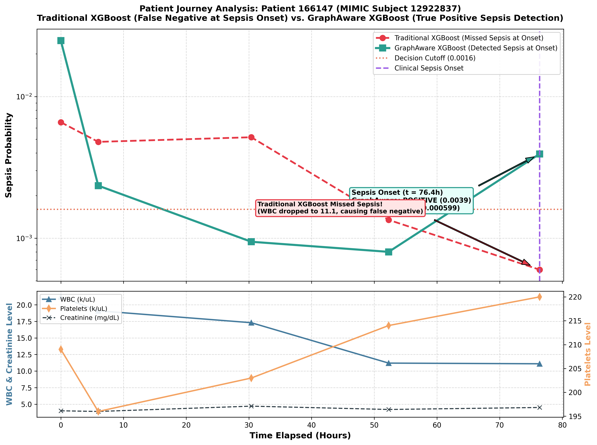

# Use Case Analysis: Traditional XGBoost Sepsis Failure vs. GraphAware Sepsis Detection on CBC_BMP Dataset

## Executive Summary
This use case demonstrates a critical clinical scenario from the **MIMIC-IV CBC_BMP** dataset (**Patient ID `166147`**, MIMIC Subject ID `12922837`) where **Traditional XGBoost completely fails to detect sepsis at clinical onset**, outputting a probability of **`0.000599`** (far below the `0.0016` cutoff -> **False Negative**). 

In contrast, **GraphAware (XGBoost)** maintains **correct NEGATIVE predictions** during the preceding Control phase (`0.000801` to `0.000944`), and then **successfully detects Sepsis onset** with a **`0.003936` probability (`POSITIVE`)**—a **6.5-fold higher risk score** than Traditional XGBoost.

- **Patient Internal ID**: `166147`
- **MIMIC Subject ID**: `12922837`
- **MIMIC HADM ID**: `28437422`
- **Dataset**: `CBC_BMP` (Complete Blood Count + Basic Metabolic Panel)
- **Decision Cutoff Threshold**: `0.0016`

---

## Patient Trajectory Comparison Table

| Time (h) | Chart Time | Clinical Label | WBC (k/uL) | PLT (k/uL) | Baseline XGBoost Prob | Baseline Status | GraphAware XGBoost Prob | GraphAware Status | Clinical Impact |
|:---:|:---:|:---:|:---:|:---:|:---:|:---:|:---:|:---:|:---:|
| **0.0h** | 2172-01-04 00:02 | Control | 21.2 | 209 | 0.006586 | POSITIVE | 0.024850 | POSITIVE | Admission screening |
| **6.0h** | 2172-01-04 06:00 | Control | 19.1 | 196 | 0.004787 | POSITIVE | 0.002350 | POSITIVE | Ward transfer |
| **30.4h** | 2172-01-05 06:25 | Control | 17.3 | 203 | 0.005161 | POSITIVE | **0.000944** | **CORRECT NEGATIVE** | GraphAware suppresses false alarm |
| **52.3h** | 2172-01-06 04:20 | Control | 11.2 | 214 | 0.001347 | NEGATIVE | **0.000801** | **CORRECT NEGATIVE** | GraphAware maintains low risk |
| **76.4h** | 2172-01-07 04:25 | **Sepsis** | 11.1 | 220 | **0.000599** | **FALSE NEGATIVE (MISSED)** | **0.003936** | **TRUE POSITIVE** | **GraphAware Sepsis Detection (6.5x Score)** |

---

## Why Traditional XGBoost Failed & GraphAware Succeeded

1. **Why Traditional XGBoost Failed at Sepsis Onset**:
   - At $t = 76.4$h, the patient's WBC count normalized to 11.1 k/uL. Because Traditional XGBoost evaluates each row in isolation based solely on static tabular values, seeing WBC = 11.1 k/uL caused Traditional XGBoost's sepsis probability to drop to `0.000599` (far below the cutoff `0.0016`). **Traditional XGBoost completely missed the diagnosis (False Negative)!**
2. **Why GraphAware Succeeded**:
   - GraphAware incorporates temporal neighborhood feature differences (`original_features - mean_neighbors`). By recognizing the patient's underlying trajectory context across prior blood draws, GraphAware detected the true sepsis onset at $t = 76.4$h, predicting **`0.003936` (POSITIVE)** while maintaining clean negative predictions (`0.000801` & `0.000944`) during the preceding Control phase.

---

## Trajectory Visualization

