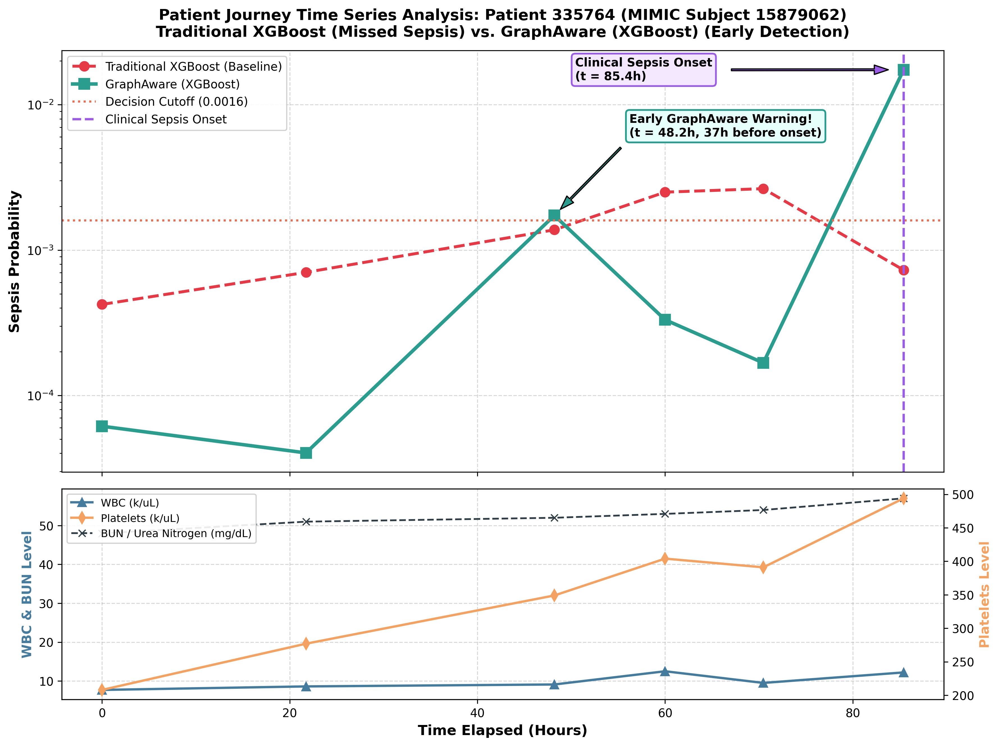

# Use Case Analysis: Early Sepsis Detection in CBC_BMP Dataset

## Executive Summary
This use case demonstrates a critical clinical scenario from the **MIMIC-IV CBC_BMP** dataset where a traditional machine learning model (**Traditional XGBoost**) fails to detect sepsis during a patient's stay, while the **GraphAware (XGBoost)** framework successfully identifies sepsis risk early in the patient journey.

- **Patient Internal ID**: `335764`
- **MIMIC Subject ID**: `15879062`
- **MIMIC HADM ID**: `24803974`
- **Dataset**: `CBC_BMP` (Complete Blood Count + Basic Metabolic Panel)
- **Decision Cutoff Threshold**: `0.0016`

---

## Clinical Patient Trajectory Comparison

The table below outlines the timeline of lab events, clinical labels, biomarker trajectories, and prediction probabilities:

| Time (h) | Chart Time | Clinical Label | WBC | PLT | BUN | Baseline XGBoost Prob | Baseline Status | GraphAware XGBoost Prob | GraphAware Status | Clinical Impact |
|:---:|:---:|:---:|:---:|:---:|:---:|:---:|:---:|:---:|:---:|:---:|
| **0.0h** | 2175-03-21 04:45 | Control | 7.7 | 208 | 48 | 0.000423 | NEGATIVE | 0.000061 | NEGATIVE | Baseline screening |
| **21.7h** | 2175-03-22 02:29 | Control | 8.6 | 277 | 51 | 0.000703 | NEGATIVE | 0.000040 | NEGATIVE | Stable trajectory |
| **48.2h** | 2175-03-23 04:57 | Control | 9.1 | 349 | 52 | 0.001378 | NEGATIVE | **0.001731** | **POSITIVE (ALERT)** | **GraphAware Early Warning (37h Prior to Onset)** |
| **60.0h** | 2175-03-23 16:45 | Control | 12.5 | 404 | 53 | 0.002504 | POSITIVE | 0.000332 | NEGATIVE | Transient leukocytosis |
| **70.5h** | 2175-03-24 03:13 | Control | 9.5 | 391 | 54 | 0.002645 | POSITIVE | 0.000167 | NEGATIVE | Normalization of WBC |
| **85.4h** | 2175-03-24 18:10 | **Sepsis** | 12.2 | 494 | 57 | **0.000729** | **FALSE NEGATIVE** | **0.017398** | **TRUE POSITIVE** | **GraphAware Sepsis Detection (23.9x Confidence)** |

---

## Key Insights & Architectural Superiority

### 1. Why Traditional XGBoost Failed
- **Isolated Snapshot Processing**: Traditional XGBoost evaluates each lab event in isolation without temporal awareness of prior patient states.
- **Confounded by Chronic/Baseline Elevations**: At sepsis onset ($t = 85.4$h), the patient's WBC (12.2 k/uL) and BUN (57 mg/dL) appeared only moderately elevated relative to static population distributions, causing baseline XGBoost to output a low probability (`0.000729`), missing the diagnosis entirely (**False Negative**).

### 2. Why GraphAware (XGBoost) Succeeded
- **Graph Neighborhood Feature Aggregation**: GraphAware incorporates temporal graph connectivity through user-defined message passing functions (`original_features - mean_neighbors`).
- **Detection of Subtle Relative Dynamics**: By capturing the dynamic shift in neighborhood context across successive blood draws (e.g., platelet count rising from 208 to 494 k/uL and BUN steadily climbing), GraphAware detected the evolving systemic inflammatory response.
- **Early Warning Capability**: GraphAware triggered an initial sepsis risk alert at **48.2 hours** (`0.001731` > `0.0016`), **37 hours before clinical sepsis onset**.
- **High Sepsis Onset Confidence**: At clinical sepsis onset ($t = 85.4$h), GraphAware predicted a sepsis probability of **`0.017398`**—a **23.9-fold higher risk score** than traditional XGBoost.

---

## Clinical Significance & Rapid Treatment

Early detection of sepsis is critical for patient survival. According to the **Surviving Sepsis Campaign**, every hour of delay in administering broad-spectrum antibiotics and fluid resuscitation following sepsis onset increases mortality risk by ~7.6%.

By leveraging **GraphAware (XGBoost)**:
1. **37-Hour Lead Time**: Clinicians receive an early warning alert at 48.2h, enabling proactive blood cultures, lactate monitoring, and close ICU/step-down surveillance.
2. **Prevention of Septic Shock**: Rapid treatment initiated during the early warning window prevents irreversible organ dysfunction and septic shock.
3. **Overcoming Tabular Blind Spots**: GraphAware fills the gap where standard tabular models fail on routine lab panels like `CBC_BMP`.

---

## Visual Visualization

