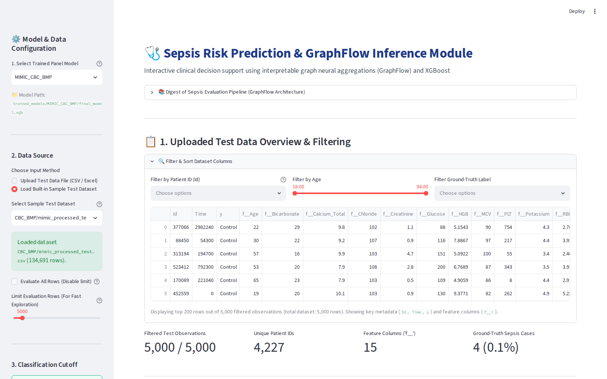
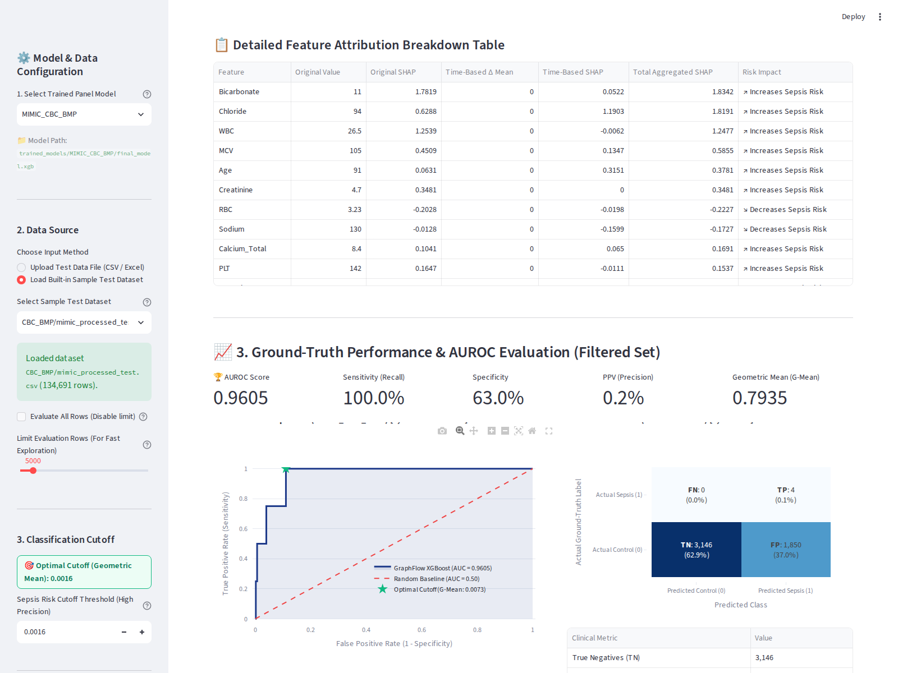
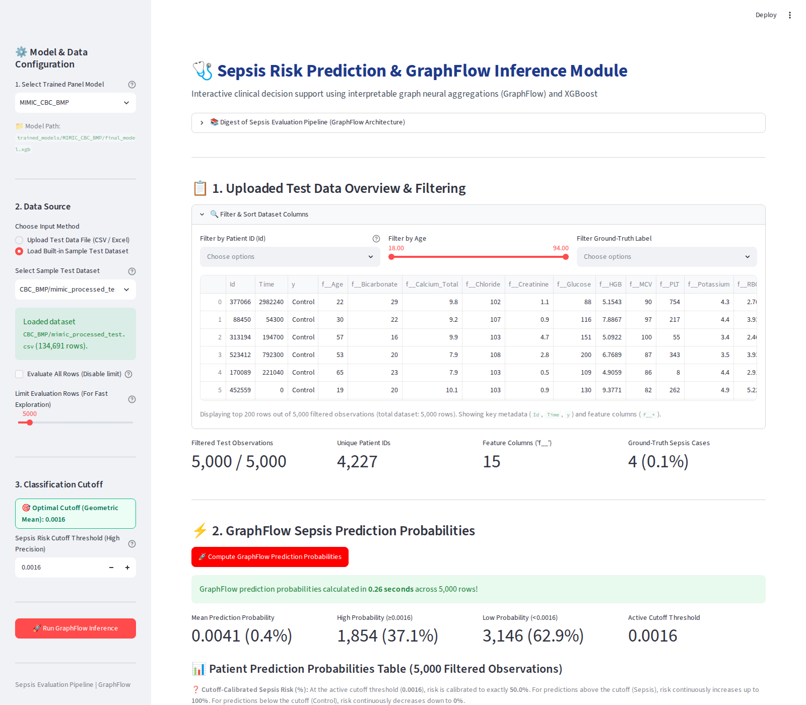

# SepsisEvalPipeline: GraphFlow Framework for Sepsis Prediction & Interpretability

[](https://www.python.org/downloads/)
[](https://docs.docker.com/compose/)
[](https://mlflow.org/)
[](https://modelcontextprotocol.io/)

**SepsisEvalPipeline / GraphFlow** is an end-to-end, reproducible, Docker-based graph learning workflow for early sepsis prediction from multi-center clinical laboratory time-series data (e.g., MIMIC-IV and SBC datasets), designed in adherence to FAIR (Findable, Accessible, Interoperable, Reusable) open science principles. 

It features time-decay temporal patient graph construction ($w = 1 - \Delta t_{\text{scaled}}$), memory-efficient mini-batch graph database storage (SQLite BLOB feature encoding & Neo4j), PyTorch Geometric Graph Attention Networks v2 (`GATv2`), the **GraphAware** spatial neighborhood feature aggregation framework, Model Context Protocol (MCP) AI integration, and an interactive Streamlit inference dashboard.

---



---

## Table of Contents

- [Key Features](#key-features)
- [Directory & Pipeline Overview](#directory--pipeline-overview)
- [Pipeline Execution Steps](#pipeline-execution-steps)
- [Environment Setup & Configuration (`.env`)](#environment-setup--configuration-env)
- [Interactive Dashboard Visualizations & Interpretability](#interactive-dashboard-visualizations--interpretability)
- [Model Context Protocol (MCP) & AI Integration](#model-context-protocol-mcp--ai-integration)
  - [Available MCP Tools](#available-mcp-tools)
  - [Starting the MCP Server](#starting-the-mcp-server)
  - [MCP Server JSON Configuration (`mcp.json`)](#mcp-server-json-configuration-mcpjson)
  - [Running the MCP Client](#running-the-mcp-client)
- [System Requirements & Setup](#system-requirements--setup)
- [MLflow Experiment Tracking](#mlflow-experiment-tracking)
- [Citation & References](#citation--references)

---

## Key Features

- **End-to-End Containerized Pipeline**: Fully modular architecture built on Docker containers for preprocessing, graph construction, database upload, model training, and explainable inference.
- **FAIR Principles & Open Science**: Decoupled, OS-independent Docker workflow ensuring Findability, Accessibility, Interoperability, and Reusability across institutions.
- **Dynamic Laboratory Panel & Sparsity Support**: Evaluates complete blood counts (`CBC`), basic metabolic panels (`BMP`), and pre-analytical quality indices (`HIL`), enabling stress-testing under real-world clinical data sparsity.
- **Time-Decay Temporal Patient Graphs**: Constructs patient-centric graph representations where edge weights reflect normalized time differences ($w = 1 - \Delta t_{\text{scaled}}$) between laboratory observations.
- **Memory-Efficient Graph Storage & Mini-Batching**: High-performance SQLite BLOB node feature storage and indexed edge list querying for low-RAM mini-batch training on standard hardware.
- **Diverse Machine Learning & Graph Suite**:
  - **Baseline ML**: Logistic Regression, Random Forest, XGBoost.
  - **Graph Neural Networks**: PyTorch Geometric Graph Attention Networks v2 (`GATv2`) with dynamic attention and edge-weight support.
  - **GraphAware**: 1-hop spatial neighborhood feature aggregation paired with XGBoost for fast, scalable graph learning.
- **Explainable AI ($2N$ SHAP Values)**: Computes aggregated local SHAP values ($\text{SHAP}_{\text{orig}} + \text{SHAP}_{\text{delta\_mean}}$) per feature to deliver clinically interpretable explanations.
- **Cross-Dataset Generalizability**: Multi-center validation pipeline evaluating model transferability across distinct hospital cohorts (e.g., MIMIC-IV and SBC internal/external hospital cohorts).
- **F₂ Score (β=2) Cutoff Optimization**: Pre-computed optimal $F_2$ score classification cutoffs tailored per laboratory panel.
- **Model Context Protocol (MCP) Server & Client**: Standardized FastMCP server interface paired with an OpenAI-compatible MCP Client for LLM agent integration.
- **Streamlit Interactive Dashboard**: Real-time sepsis risk assessment, calibrated risk scores, ROC/AUROC evaluation, and patient SHAP visualizations.

---

## Directory & Pipeline Overview

```
SepsisEvalPipeline/
├── 0_mimic_preprocess/         # Step 0: MIMIC-IV raw extraction & itemid lab mapping
├── 1_preprocess/               # Step 1: Lab data normalization, panel filtering & splitting
├── 2_baseline/                 # Step 2: Baseline ML models (LogReg, Random Forest, XGBoost)
├── 3_graph_construction/       # Step 3: Temporal patient graph construction with time decay
├── 4_db_upload/                # Step 4: Upload graph nodes & edges to SQLite / Neo4j
├── 5_gnn_training/             # Step 5: PyTorch Geometric GNN (GATv2) mini-batch training
├── 6_graphaware/               # Step 6: GraphAware 1-hop spatial neighborhood XGBoost & SHAP
├── 7_inference/                # Step 7: Streamlit dashboard app & optimal F₂ score cutoffs
├── 8_example_use_cases/        # Step 8: Jupyter notebooks & programmatic usage examples
├── mcp_server/                 # FastMCP Server providing RPC tools for pipeline & LLM access
├── mcp_client.py               # OpenAI-compatible MCP Client script for LLM agent execution
├── docker-compose-mcp.yml      # Docker Compose config for full MCP + MLflow service stack
├── docker-compose.yml          # Core Docker Compose orchestration
├── docker-compose-ram.yml      # Low-RAM memory optimized Docker Compose configuration
├── pipeline.sh                 # Sequential bash wrapper script for steps 2 to 6
├── config.ini                  # Global system configuration (paths, panels, hyperparameters)
└── .env                        # Local environment variables (LLM credentials, HOST_UID, HOST_GID)
```

---

## Pipeline Execution Steps

### 0. MIMIC-IV Preprocessing (`0_mimic_preprocess/`)
- **Prerequisite**: MIMIC-IV requires a free [PhysioNet credentialed-access account](https://physionet.org/content/mimiciv/) ([documentation](https://mimic.mit.edu/docs/iv/)). Download the `hosp` module and place its CSVs under `./mimic/hosp/` in the repo root (e.g. `./mimic/hosp/labevents.csv`, `./mimic/hosp/d_labitems.csv`, ...) - `docker-compose.yml` mounts `./mimic` as `/app/input`. If this data is missing, `docker compose up` (and `pipeline.sh`) will fail fast with a message pointing back here instead of running.
- `0_mimic_preprocess/extdata/icumap.csv` is a small curated lookup table tracked in the repo; `0_mimic_preprocess/extdata/d_labitems.csv` is raw MIMIC-IV content and is instead copied in automatically from `./mimic/hosp/d_labitems.csv` at container startup - no manual setup needed for either.
- Preprocesses MIMIC-IV clinical data according to Steinbach et al. criteria.
- Maps raw lab item IDs to standardized lab codes using `panel_name_to_feature_codes.py` (also run automatically inside the container).
- **Output**: Preprocessed dataset files under `0_mimic_preprocess/preprocessed_file/`.

### 1. Pre-processing (`1_preprocess/`)
- Cleans, standardizes, and splits MIMIC-IV and SBC laboratory data into train, validation, and test sets.
- Filters observations according to configured lab panels (`config.ini`).
- **Output**: Clean CSV files under `1_preprocess/data/preprocessed_data/`.

### 2. Machine Learning Baselines (`2_baseline/`)
- Trains baseline Logistic Regression, Random Forest, and XGBoost classifiers.
- Logs evaluation metrics to MLflow.
- **Output**: Trained models in `2_baseline/models/`.

### 3. Temporal Graph Construction (`3_graph_construction/`)
- Constructs directed patient-centric temporal graphs where edges link sequential laboratory measurements.
- Calculates exponential time-decay edge weights based on time elapsed between measurements ($w = 1 - \Delta t_{\text{scaled}}$).
- **Output**: Graph node and edge CSV files in `3_graph_construction/data/`.

### 4. Database Upload (`4_db_upload/`)
- Imports graph nodes, edges, and feature vectors into SQLite (`sqlite_data/mimic_sbc_graph.db` using BLOB feature encoding and indexed edge tables) or Neo4j database instances.
- **Output**: SQLite / Neo4j database files.

### 5. GNN Training (`5_gnn_training/`)
- Fetches mini-batches from the graph database and trains Graph Attention Networks v2 (`GATv2`) with edge weight support via PyTorch Geometric.
- **Output**: Trained model checkpoints in `5_gnn_training/checkpoints/` and MLflow metric logs.

### 6. GraphAware Training (`6_graphaware/`)
- Extracts 1-hop spatial neighborhood features using time-decay weighted mean aggregations.
- Trains an XGBoost classifier on aggregated neighborhood features and calculates $2N$ aggregated SHAP feature attributions.
- **Output**: Trained GraphAware models in `6_graphaware/models/` and SHAP summary plots.

### 7. Interactive Inference & Dashboard (`7_inference/`)
- Interactive Streamlit dashboard (`app.py`) providing real-time sepsis risk prediction, calibrated probability percentage, ROC/AUROC curves, and local SHAP explanation breakdowns.

---

## Environment Setup & Configuration (`.env`)

To run the pipeline services and Docker containers smoothly, create a `.env` file in the root directory.

> [!IMPORTANT]
> **User Permissions Requirement**: You **MUST** define `HOST_UID` and `HOST_GID` in your `.env` file so that files created inside Docker containers match the user and group IDs of your host machine.

Example `.env` configuration:

```env
# Host User & Group ID (Required for Docker container volume permissions)
HOST_UID=1000
HOST_GID=1000

# OpenAI-Compatible LLM Credentials (Required for MCP Client)
OPENAI_API_KEY="sk-..."
OPENAI_BASE_URL="https://llm.bi.denbi.de/v1"
OPENAI_MODEL="vllm/google/gemma-4-31B-it"

# Pipeline & App Parameters
APP_NAME=SepsisEvaluationPipeline
LOG_LEVEL=INFO
SEED=42
```

Populate `HOST_UID` and `HOST_GID` on Linux/macOS using:
```bash
echo "HOST_UID=$(id -u)" >> .env
echo "HOST_GID=$(id -g)" >> .env
```

---

## Interactive Dashboard Visualizations & Interpretability

The Streamlit inference application provides three dedicated analytical views:

### 1. Sepsis Prediction Probabilities & Risk Calibrated Table


**Explanation**:
- **Cutoff-Calibrated Sepsis Risk (%)**: Calibrates the raw output probability $P(\text{Sepsis})$ relative to the active $F_2$ score cutoff threshold $c$.
  - At raw probability $P = c$, calibrated risk is defined as **50.0%**.
  - Above the cutoff ($P \ge c$), risk increases continuously from 50% to 100%.
  - Below the cutoff ($P < c$), risk decreases continuously from 50% down to 0%.
- **Interactive Row Selection**: Users can click directly on any patient row in the table to trigger local SHAP feature explanations.

---

### 2. Ground-Truth Performance Evaluation (ROC Curve, AUROC & Confusion Matrix)



**Explanation**:
- **ROC Curve & AUROC Score**: Displays the Receiver Operating Characteristic curve comparing True Positive Rate (Sensitivity) against False Positive Rate ($1 - \text{Specificity}$). The overall area under the curve (AUROC) summarizes discriminative performance across all decision thresholds.
- **Optimal Cutoff Star Marker ($\star$)**: Identifies the optimal threshold maximizing the $F_2$ score ($\beta=2$) weighting Sensitivity (Recall) 4x over Precision:

  $$F_2 = \frac{5 \times \text{PPV} \times \text{Sensitivity}}{4 \times \text{PPV} + \text{Sensitivity}}$$

- **Annotated Confusion Matrix**: Heatmap detailing True Negatives (TN), False Positives (FP), False Negatives (FN), and True Positives (TP) at the active decision threshold, alongside Sensitivity, Specificity, PPV (Precision), and NPV metrics.

---

### 3. Local SHAP Explanation & GraphFlow Feature Attribution ($2N$ Decomposed Values)



**Explanation**:
- **Total Aggregated Local SHAP Bar Chart**: Shows the net directional impact of each lab feature on the sepsis risk score for a selected patient.
  - **Red bars ($\text{SHAP} > 0$)**: Features driving the prediction *towards* high Sepsis risk (e.g., elevated Age or abnormal MCV).
  - **Blue bars ($\text{SHAP} < 0$)**: Protective features driving the prediction *away* from Sepsis (e.g., normal WBC or HGB levels).
- **GraphFlow Attribution Breakdown (Original vs. $\Delta$ Mean)**: Decomposes the total SHAP attribution into two distinct physical components:
  1. **Original Feature SHAP** ($\mathbf{X}_{\text{orig}}$): Contribution of the patient's current static laboratory values.
  2. **Time-Based $\Delta$ Mean SHAP** ($\mathbf{X}_{\text{orig}} - \boldsymbol{\mu}_{\text{neighbors}}$): Contribution of the patient's temporal trend relative to their historical 1-hop spatial neighborhood.
- **Detailed Attribution Breakdown Table**: Quantifies the exact raw values, time-based delta mean values, individual SHAP values, and risk impact directions for clinical auditability.

---

## Model Context Protocol (MCP) & AI Integration

The repository includes a **FastMCP Server** ([mcp_server/server.py](file:///home/daniel.walke/git/SepsisEvalPipeline/mcp_server/server.py)) and an **OpenAI-Compatible MCP Client** ([mcp_client.py](file:///home/daniel.walke/git/SepsisEvalPipeline/mcp_client.py)), allowing LLM agents (e.g. OpenAI GPT-4o, DeepSeek, Ollama, vLLM, Groq, OpenRouter) to programmatically inspect and control the pipeline.

### Available MCP Tools

| MCP Tool Name | Description |
| :--- | :--- |
| `list_pipeline_steps` | Returns all pipeline steps (Steps 0 to 6) and their docker-compose services. |
| `run_pipeline_step` | Trains/builds a panel through `docker compose up --build <service>` per step, from MIMIC extraction (Step 0) through the requested step (or `all_steps`, through Step 6). Automatically runs any earlier steps whose output doesn't exist yet for the panel, and skips steps already trained for it (set `force_retrain=True` to redo them). OS-independent - runs each step in its own container, not the host Python environment. |
| `get_mlflow_experiment_results` | Queries MLflow SQLite DB for past experiment metrics and hyperparameters. |
| `get_optimal_cutoffs` | Fetches pre-calculated optimal $F_2$ score ($\beta=2$) classification cutoffs. |
| `run_graphflow_inference` | Runs GraphFlow 1-hop spatial neighborhood inference on sample datasets. |
| `explain_patient_prediction` | Computes $2N$ aggregated SHAP values for a specific patient observation. |
| `get_dashboard_status` | Checks if the Streamlit inference dashboard is active on port 8501. |

### Starting the MCP Server

You can start the FastMCP Server in two ways depending on your execution preference:

#### Method 1: Local Virtual Environment (Stdio Mode)

To run the MCP server directly using your local Python environment:

```bash
# Activate virtual environment
source .venv/bin/activate

# Launch the FastMCP Server (runs in stdio mode)
python mcp_server/server.py
```

#### Method 2: Containerized Execution (Docker Compose)

To launch the MCP server as part of the full stack (alongside MLflow and the Streamlit Dashboard):

```bash
# Launch full service stack including mcp-server container
docker-compose -f docker-compose-mcp.yml up -d

# Or launch only the mcp-server service:
docker-compose -f docker-compose-mcp.yml up -d mcp-server
```

### MCP Server JSON Configuration (`mcp.json`)

To connect external LLM applications (such as Claude Desktop, Cursor, Antigravity, VS Code, or custom AI agents) directly to the GraphFlow FastMCP server, copy one of the following JSON configuration blocks into your client's `mcp.json` or `claude_desktop_config.json` file:

#### Configuration A: Local Virtual Environment Stdio Mode

*(Recommended for Claude Desktop, Cursor, or local IDEs running directly on your host machine)*

```json
{
  "mcpServers": {
    "sepsis-eval-pipeline": {
      "command": "/home/daniel.walke/git/SepsisEvalPipeline/.venv/bin/python",
      "args": [
        "/home/daniel.walke/git/SepsisEvalPipeline/mcp_server/server.py"
      ],
      "env": {
        "PYTHONUNBUFFERED": "1"
      }
    }
  }
}
```

> **Note**: Replace `/home/daniel.walke/git/SepsisEvalPipeline` with the absolute path to your local repository clone.

#### Configuration B: Docker Compose Execution Mode

*(Recommended when running the pipeline in containerized environments)*

```json
{
  "mcpServers": {
    "sepsis-eval-pipeline": {
      "command": "docker",
      "args": [
        "exec",
        "-i",
        "mcp_pipeline_server",
        "python",
        "/app/mcp_server/server.py"
      ]
    }
  }
}
```

### Running the MCP Client

You can run [mcp_client.py](file:///home/daniel.walke/git/SepsisEvalPipeline/mcp_client.py) using environment variables defined in [.env](file:///home/daniel.walke/git/SepsisEvalPipeline/.env):

```bash
# Ensure .env contains OPENAI_API_KEY, OPENAI_BASE_URL, and OPENAI_MODEL
.venv/bin/python mcp_client.py --prompt "Check dashboard status and explain patient row index 0 for MIMIC_CBC panel."
```

Or pass flags explicitly:
```bash
.venv/bin/python mcp_client.py \
  --api-key "your-api-key" \
  --base-url "https://llm.bi.denbi.de/v1" \
  --model "vllm/google/gemma-4-31B-it" \
  --prompt "Run all pipeline steps and explain performance metrics."
```

---


## System Requirements & Setup

### Requirements
- **OS**: Linux / macOS / WSL2
- **Python**: 3.10+
- **Docker & Docker Compose**: Recommended for containerized deployment
- **Hardware**: 16 GB+ RAM (32 GB recommended for GNN graph construction), NVIDIA GPU (optional, for GNN/GraphAware acceleration)

### Installation

1. **Clone the repository**:
   ```bash
   git clone https://github.com/danielwalke/SepsisEvalPipeline.git
   cd SepsisEvalPipeline
   ```

2. **Set up Virtual Environment**:
   ```bash
   python3 -m venv .venv
   source .venv/bin/activate
   pip install -r requirements.txt
   ```

3. **Configure Environment (`.env` and `config.ini`)**:
   - Update `config.ini` for data paths, selected panel names, and hyperparameters.
   - Set up `.env` with required `HOST_UID`, `HOST_GID`, and LLM credentials.

### Docker Compose Quickstart

Launch MLflow tracking, inference, and the MCP server using Docker Compose:

```bash
docker-compose -f docker-compose-mcp.yml up -d
```

- **MLflow Tracking UI**: `http://localhost:5000`
- **GraphFlow Dashboard**: `http://localhost:8501`

---

## MLflow Experiment Tracking

All training runs (baseline models, GNNs, and GraphAware) automatically record hyperparameters and metrics into the backend MLflow database (`mlflow_data/mlflow.db`).

Start MLflow manually:
```bash
./start_ml_flow.sh
```

---

## Citation & References

### Citation Placeholder

If you use GraphFlow or this framework in your research, please cite our paper:

```bibtex
@article{walke2024graphflow,
  title={GraphFlow: End-to-end graph learning workflow exemplified for predicting sepsis},
  author={Walke, Daniel and Staritzbichler, Ren{\'e} and Kaiser, Thorsten and Saake, Gunter and Broneske, David and Heyer, Robert},
  journal={Under Review / In Preparation},
  year={2024}
}
```

### Key References

1. **Steinbach et al. (2024)**: *Applying Machine Learning to Blood Count Data Predicts Sepsis with ICU Admission.* Clinical Chemistry. [DOI: 10.1093/clinchem/hvae001](https://doi.org/10.1093/clinchem/hvae001)
2. **Walke et al. (2025)**: *Edges are all you need: Potential of medical time series analysis on complete blood count data with graph neural networks.* PLOS ONE 20(7): e0327636. [DOI: 10.1371/journal.pone.0327636](https://doi.org/10.1371/journal.pone.0327636)
3. **Walke et al. (2025)**: *GraphAware: Interpretable machine learning on graphs.* Preprint at Research Square. [DOI: 10.21203/rs.3.rs-7471432/v1](https://doi.org/10.21203/rs.3.rs-7471432/v1)
4. **Lundberg & Lee (2017)**: *A Unified Approach to Interpreting Model Predictions.* NIPS 2017. [DOI: 10.5555/3295222.3295230](https://doi.org/10.5555/3295222.3295230)