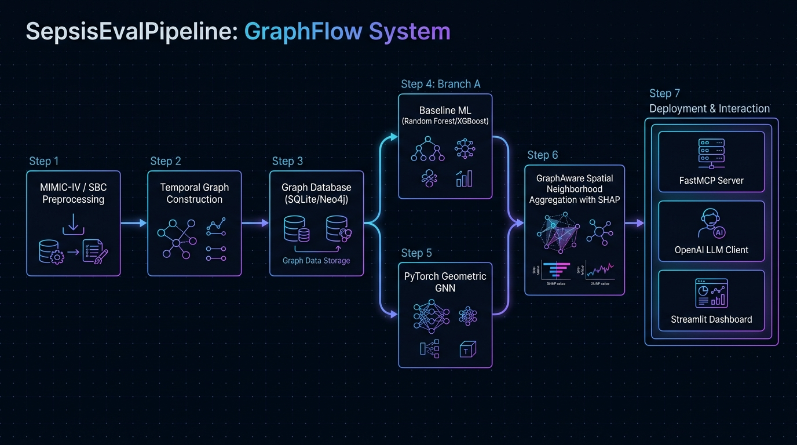
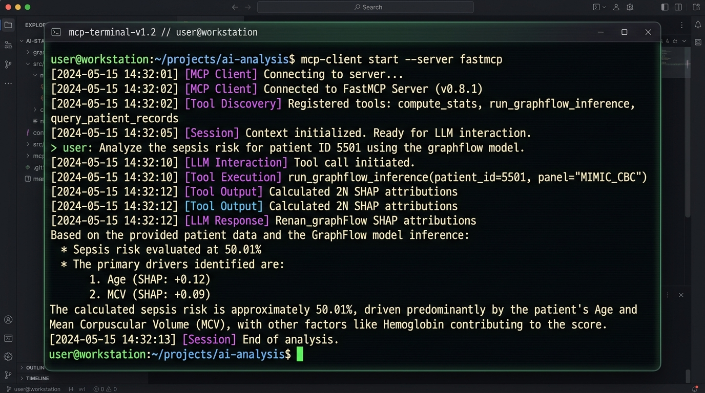
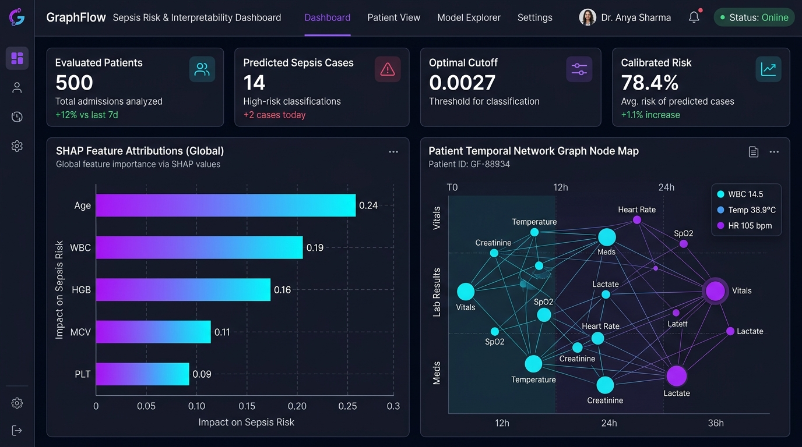

# SepsisEvalPipeline: GraphFlow Framework for Sepsis Prediction & Interpretability

[](https://www.python.org/downloads/)
[](https://docs.docker.com/compose/)
[](https://mlflow.org/)
[](https://modelcontextprotocol.io/)

**SepsisEvalPipeline** is an end-to-end, graph-aware machine learning framework for early sepsis prediction from multi-center clinical laboratory time-series data (e.g., MIMIC-IV and SBC datasets). 

It features time-decay patient temporal graph construction, graph database storage (SQLite & Neo4j), PyTorch Geometric Graph Neural Networks (GNNs), the **GraphAware** spatial neighborhood feature aggregation framework, Model Context Protocol (MCP) AI integration, and an interactive Streamlit inference dashboard.

---



---

## Key Features

- **Modular 8-Step Pipeline**: Complete separation of preprocessing, graph construction, database upload, model training, and inference.
- **Dynamic Laboratory Panel Support**: Supports custom lab panels (`CBC`, `CBC_BMP`, `BMP`, `HIL`, `LIVER`, `COAG`, `KIDNEY`, `WBCDIFF`, etc.).
- **Time-Decay Temporal Patient Graphs**: Constructs patient-centric graph representations where edge weights reflect time differences between laboratory observations.
- **Graph Storage Options**: Efficient graph storage using SQLite (`mimic_sbc_graph.db`) or Neo4j graph database backends.
- **Diverse Machine Learning Suite**:
  - **Baseline ML**: Logistic Regression, Random Forest, XGBoost.
  - **Graph Neural Networks**: PyTorch Geometric Graph Attention Networks (GAT).
  - **GraphAware**: 1-hop spatial neighborhood feature aggregation paired with XGBoost for fast, scalable graph learning.
- **Explainable AI ($2N$ SHAP Values)**: Computes aggregated local SHAP values ($\text{SHAP}_{\text{orig}} + \text{SHAP}_{\text{delta\_mean}}$) per feature to deliver clinically interpretable explanations.
- **Geometric Mean (G-Mean) ROC Optimization**: Pre-computed optimal ROC classification cutoffs tailored per laboratory panel.
- **Model Context Protocol (MCP) Server & Client**: Standardized FastMCP server interface paired with an OpenAI-compatible MCP Client for LLM agent integration.
- **Streamlit Interactive Dashboard**: Real-time sepsis risk assessment, calibrated risk scores, and patient SHAP visualizations.

---

## Directory & Pipeline Overview

```
SepsisEvalPipeline/
├── 0_mimic_preprocess/         # Step 0: MIMIC-IV raw extraction & itemid lab mapping
├── 1_preprocess/               # Step 1: Lab data normalization, panel filtering & splitting
├── 2_baseline/                 # Step 2: Baseline ML models (LogReg, Random Forest, XGBoost)
├── 3_graph_construction/       # Step 3: Temporal patient graph construction with time decay
├── 4_db_upload/                # Step 4: Upload graph nodes & edges to SQLite / Neo4j
├── 5_gnn_training/             # Step 5: PyTorch Geometric GNN (GAT) mini-batch training
├── 6_graphaware/               # Step 6: GraphAware 1-hop spatial neighborhood XGBoost & SHAP
├── 7_inference/                # Step 7: Streamlit dashboard app & optimal G-Mean cutoffs
├── 8_example_use_cases/        # Step 8: Jupyter notebooks & programmatic usage examples
├── mcp_server/                 # FastMCP Server providing RPC tools for pipeline & LLM access
├── mcp_client.py               # OpenAI-compatible MCP Client script for LLM agent execution
├── docker-compose-mcp.yml      # Docker Compose config for full MCP + MLflow service stack
├── docker-compose.yml          # Core Docker Compose orchestration
├── docker-compose-ram.yml      # Low-RAM memory optimized Docker Compose configuration
├── pipeline.sh                 # Sequential bash wrapper script for steps 2 to 6
├── config.ini                  # Global system configuration (paths, panels, hyperparameters)
└── .env                        # Local environment variables (LLM API keys, base URLs, seed)
```

---

## Pipeline Execution Steps

### 0. MIMIC-IV Preprocessing (`0_mimic_preprocess/`)
- Preprocesses MIMIC-IV clinical data according to Steinbach et al. criteria.
- Maps raw lab item IDs to standardized lab codes using `panel_name_to_feature_codes.py`.
- **Output**: Preprocessed dataset files under `0_mimic_preprocess/preprocessed_file/`.

### 1. Pre-processing (`1_preprocess/`)
- Cleans, standardizes, and splits MIMIC-IV and SBC laboratory data into train, validation, and test sets.
- Filters observations according to configured lab panels (`config.ini`).
- **Output**: Clean CSV files under `1_preprocess/data/preprocessed_data/`.

### 2. Machine Learning Baselines (`2_baseline/`)
- Trains baseline Logistic Regression, Random Forest, and XGBoost classifiers.
- Logs AUROC, Sensitivity, and Specificity metrics to MLflow.
- **Output**: Trained models in `2_baseline/models/`.

### 3. Temporal Graph Construction (`3_graph_construction/`)
- Constructs directed patient-centric temporal graphs where edges link sequential laboratory measurements.
- Calculates exponential time-decay edge weights based on time elapsed between measurements.
- **Output**: Graph node and edge CSV files in `3_graph_construction/data/`.

### 4. Database Upload (`4_db_upload/`)
- Imports graph nodes, edges, and feature vectors into SQLite (`sqlite_data/mimic_sbc_graph.db`) or Neo4j database instances.
- **Output**: SQLite / Neo4j database files.

### 5. GNN Training (`5_gnn_training/`)
- Fetches mini-batches from the graph database and trains Graph Attention Networks (GAT) with edge weight support via PyTorch Geometric.
- **Output**: Trained model checkpoints in `5_gnn_training/checkpoints/` and MLflow metric logs.

### 6. GraphAware Training (`6_graphaware/`)
- Extracts 1-hop spatial neighborhood features using time-decay weighted mean aggregations.
- Trains an XGBoost classifier on aggregated neighborhood features and calculates $2N$ aggregated SHAP feature attributions.
- **Output**: Trained GraphAware models in `6_graphaware/models/` and SHAP summary plots.

### 7. Interactive Inference & Dashboard (`7_inference/`)
- Interactive Streamlit dashboard (`app.py`) providing real-time sepsis risk prediction, calibrated probability percentage, and local SHAP explanation breakdowns.

---

## Model Context Protocol (MCP) & AI Integration

The repository includes a **FastMCP Server** ([mcp_server/server.py](file:///home/daniel.walke/git/SepsisEvalPipeline/mcp_server/server.py)) and an **OpenAI-Compatible MCP Client** ([mcp_client.py](file:///home/daniel.walke/git/SepsisEvalPipeline/mcp_client.py)), allowing LLM agents (e.g. OpenAI GPT-4o, DeepSeek, Ollama, vLLM, Groq, OpenRouter) to programmatically inspect and control the pipeline.



### Available MCP Tools

| MCP Tool Name | Description |
| :--- | :--- |
| `list_pipeline_steps` | Returns all pipeline steps (Steps 2 to 7) and their script paths. |
| `run_pipeline_step` | Programmatically executes a specific pipeline step or all steps sequentially. |
| `get_mlflow_experiment_results` | Queries MLflow SQLite DB for past experiment metrics and hyperparameters. |
| `get_optimal_cutoffs` | Fetches pre-calculated Geometric Mean (G-Mean) ROC classification cutoffs. |
| `run_graphflow_inference` | Runs GraphFlow 1-hop spatial neighborhood inference on sample datasets. |
| `explain_patient_prediction` | Computes $2N$ aggregated SHAP values for a specific patient observation. |
| `get_dashboard_status` | Checks if the Streamlit inference dashboard is active on port 8501. |

### Running the MCP Client

You can run [mcp_client.py](file:///home/daniel.walke/git/SepsisEvalPipeline/mcp_client.py) using environment variables defined in [.env](file:///home/daniel.walke/git/SepsisEvalPipeline/.env):

```bash
# Ensure .env contains OPENAI_API_KEY, OPENAI_BASE_URL, and OPENAI_MODEL
.venv/bin/python mcp_client.py --prompt "Check dashboard status and explain patient row index 0 for MIMIC_CBC panel."
```

Or pass flags explicitly:
```bash
.venv/bin/python mcp_client.py \
  --api-key "your-api-key" \
  --base-url "https://llm.bi.denbi.de/v1" \
  --model "vllm/google/gemma-4-31B-it" \
  --prompt "Run all pipeline steps and explain performance metrics."
```

---

## GraphFlow Streamlit Dashboard

The Streamlit web application provides a visual UI for clinical decision support.



### Launching the Dashboard

```bash
.venv/bin/python -m streamlit run 7_inference/app.py --server.port=8501
```
Access the dashboard at `http://localhost:8501`.

---

## System Requirements & Setup

### Requirements
- **OS**: Linux / macOS / WSL2
- **Python**: 3.10+
- **Docker & Docker Compose**: Recommended for containerized deployment
- **Hardware**: 16 GB+ RAM (32 GB recommended for GNN graph construction), NVIDIA GPU (optional, for GNN/GraphAware acceleration)

### Installation

1. **Clone the repository**:
   ```bash
   git clone https://github.com/danielwalke/SepsisEvalPipeline.git
   cd SepsisEvalPipeline
   ```

2. **Set up Virtual Environment**:
   ```bash
   python3 -m venv .venv
   source .venv/bin/activate
   pip install -r requirements.txt
   ```

3. **Configure Environment (`.env` and `config.ini`)**:
   - Update `config.ini` for data paths, selected panel names, and hyperparameters.
   - Create `.env` for LLM credentials:
     ```env
     OPENAI_API_KEY="your-api-key"
     OPENAI_BASE_URL="https://api.openai.com/v1"
     OPENAI_MODEL="gpt-4o"
     ```

### Docker Compose Quickstart

Launch MLflow tracking, inference, and the MCP server using Docker Compose:

```bash
docker-compose -f docker-compose-mcp.yml up -d
```

- **MLflow Tracking UI**: `http://localhost:5000`
- **GraphFlow Dashboard**: `http://localhost:8501`

---

## MLflow Experiment Tracking

All training runs (baseline models, GNNs, and GraphAware) automatically record hyperparameters, AUROC scores, Sensitivity, and Specificity into the backend MLflow database (`mlflow_data/mlflow.db`).

Start MLflow manually:
```bash
./start_ml_flow.sh
```

---

## References

1. **Steinbach et al. (2024)**: *Applying Machine Learning to Blood Count Data Predicts Sepsis with ICU Admission.* Clinical Chemistry. [DOI: 10.1093/clinchem/hvae001](https://doi.org/10.1093/clinchem/hvae001)
2. **Walke et al. (2025)**: *Edges are all you need: Potential of medical time series analysis on complete blood count data with graph neural networks.* PLOS ONE 20(7): e0327636. [DOI: 10.1371/journal.pone.0327636](https://doi.org/10.1371/journal.pone.0327636)
3. **Walke et al. (2025)**: *GraphAware: Interpretable machine learning on graphs.* Preprint at Research Square. [DOI: 10.21203/rs.3.rs-7471432/v1](https://doi.org/10.21203/rs.3.rs-7471432/v1)
4. **Lundberg & Lee (2017)**: *A Unified Approach to Interpreting Model Predictions.* NIPS 2017. [DOI: 10.5555/3295222.3295230](https://doi.org/10.5555/3295222.3295230)